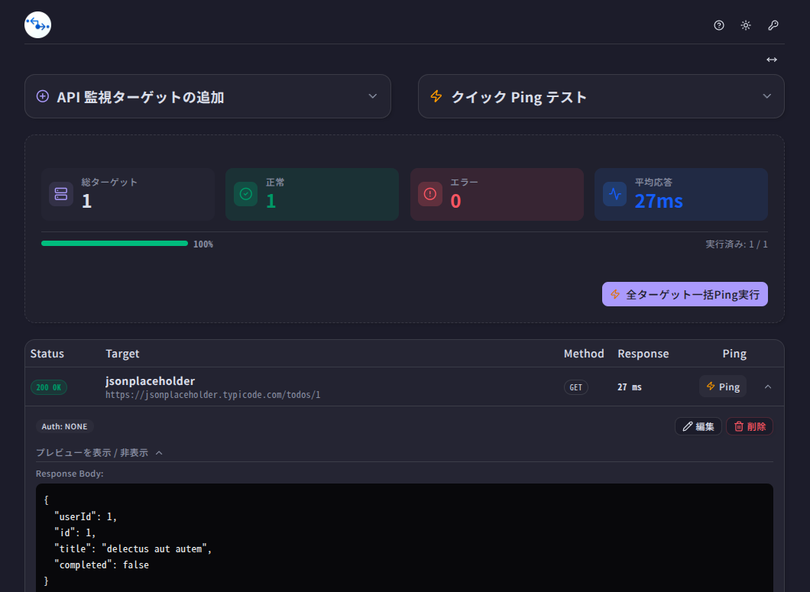

# API health-check

<p align="center">
  
</p>

API エンドポイントのヘルスチェックツール（Electron デスクトップアプリ）

登録した URL に Ping を送り、ステータスコード・応答時間・レスポンスボディを確認できます。
API キーはマスターパスワードから導出した鍵で暗号化して端末内に保存します。

## 特徴

- **ローカル完結** — サーバを持たず、データは端末内の SQLite に保存されます。
- **マスターパスワード必須** — 解錠しない限りアプリの機能を使えません。
  - マスターパスワードは保存されません。忘れると暗号化された API キーは復旧できません。
- **API キーの暗号化** — 平文のキーは保存されません。
- **ローカルサーバも監視可能** — `localhost` やプライベート IP も登録できます。
- PCの移行やOSの初期化をしてもマスターパスワードがある場合、データを復元できます。

## データの保存場所

`app.getPath("userData")/api-health-check.db`（SQLite）。

# インストール

- `snap`はUbuntu24、`.exe`はWindows11で動作確認済み

## Linux

- `.deb` , `AppImage`
  - [Releases](https://github.com/Mr-Pontaman/electron-api-health-check/releases) Page

- Snap

```
sudo snap install api-health-check
```

- [Snap Store](https://snapcraft.io/api-health-check)

### Windows

- `.exe`
  - [Releases](https://github.com/Mr-Pontaman/electron-api-health-check/releases) Page
